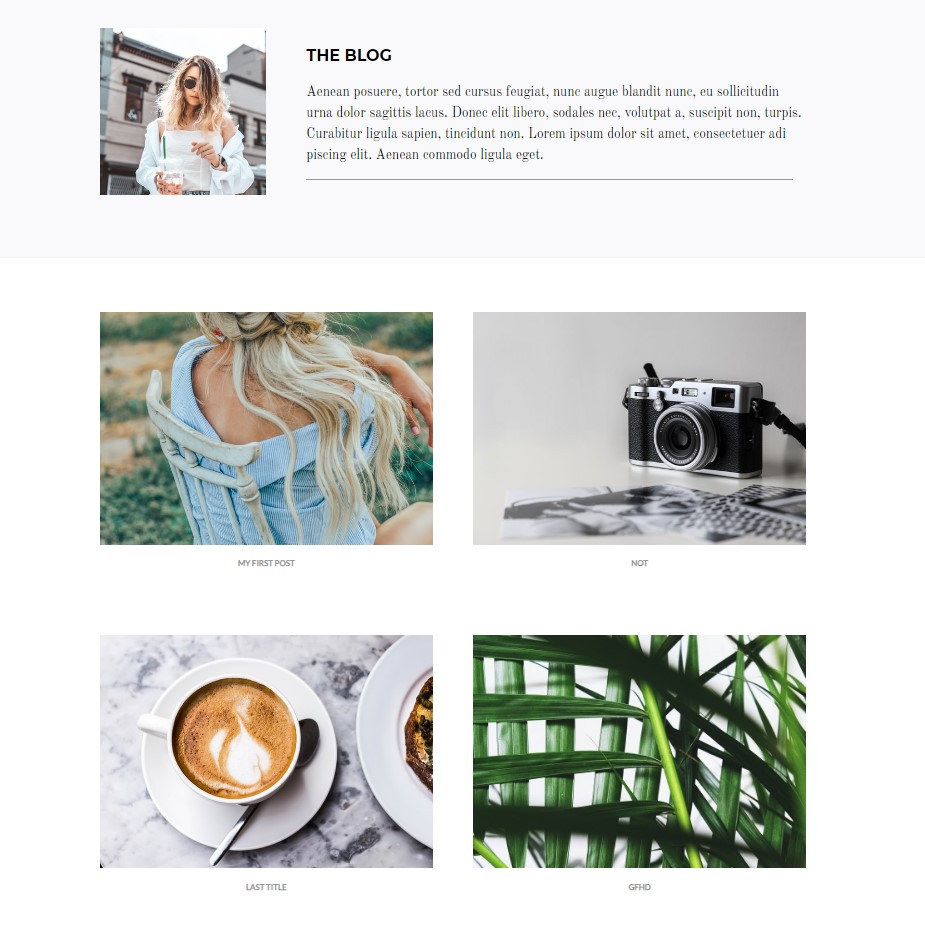

## Description

Travel/Photograph blog site using MERN.\
Design from [here](http://kate.theroar.nl)

### Usage

This project was bootstrapped with [Create React App](https://github.com/facebook/create-react-app).

Client:

```
git clone "repository url"
cd "repository folder"
npm i
npm start
```

Server:

```
cd server
npm i
npm start
```


For running the server:
- you'll need a url of an [empty database](https://docs.atlas.mongodb.com/getting-started) from [mongodb atlas](https://www.mongodb.com/cloud/atlas)
- copy your key in server/.env.sample
- rename .env.sample to .env

You can create blog post through "localhost:3000/admin" and you can check them on "localhost:3000/blog".

Admin page:


Blog page:



